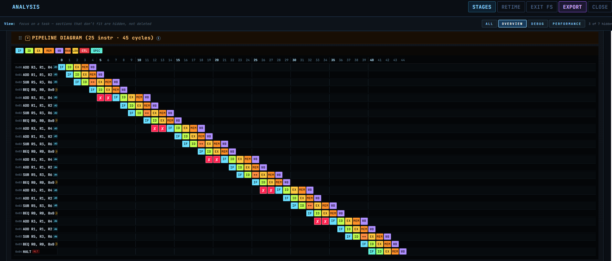
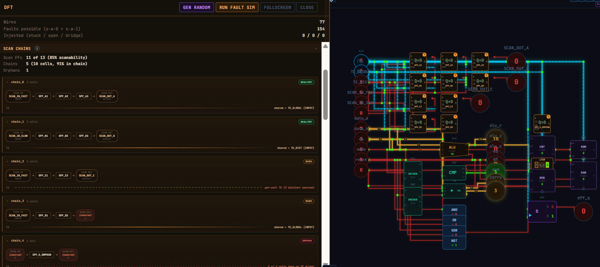
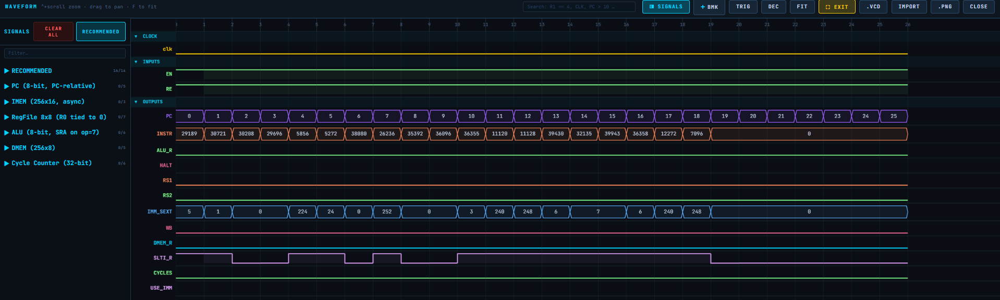
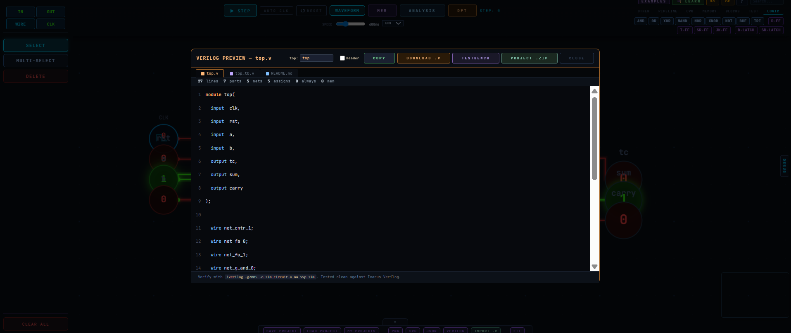

# Circuit Designer Pro

A browser-based digital design and verification environment: schematic capture, cycle-accurate simulation, industry-grade waveform analysis (VCD import/export), built-in CPU + assembler, pipeline analyzer, DFT panel, and Verilog import/export.

[](https://maozepstein.github.io/Circuit-Designer/app.html)

<p align="center">
  
  
</p>

---

## Features

- **40+ digital components** — gates, flip-flops, latches, MUX/DEMUX/decoder/encoder, adders, comparators, RAM, ROM, register file, FIFO, stack, PC, ALU, IR, CU, BUS, IMM, pipeline registers
- **Cycle-accurate simulation** — DAG-based propagation, rising-edge clocking, multi-bit buses, full CPU feedback loops
- **Waveform Pro** — GTKWave-class viewer with VCD import/export, pattern search, triggers, bookmarks, signal picker. [docs/waveform.md](docs/waveform.md)
- **Built-in 16-bit CPU** — 16-opcode ISA, single-cycle + 5-stage pipelined variants, ROM editor (HEX + Assembly + Quick Builder), assembler/disassembler, two C-like compilers. [docs/cpu.md](docs/cpu.md)
- **Pipeline analyzer** — stage levelization, hazard detection (RAW/WAR/WAW/LOOP), program hazards, forwarding, auto-retime, Gantt diagram, multi-clock CDC. [docs/pipelining.md](docs/pipelining.md)
- **DFT panel** — fault injection (stuck-at / open / bridge), auto-detected scan chains, LFSR pattern generators, MISR signature compactor, BIST controller, JTAG TAP. [docs/dft.md](docs/dft.md)
- **Verilog import/export** — synthesizable subset, Yosys-verified round-trip, fidelity mode for byte-perfect re-emission. [docs/hdl-plan.md](docs/hdl-plan.md)
- **Memory inspector** — live per-bit register view, RAM/ROM tables, click-to-toggle, HEX/BIN/DEC formats
- **Mobile viewer** — open the app on a phone for read-only review of existing designs (pan, pinch-zoom, simulation, all panels)
- **Local + cloud storage** — IndexedDB auto-save plus Firebase project sync; full undo/redo for every operation

## Quick Start

```bash
git clone https://github.com/MaozEpstein/Circuit-Designer.git
cd Circuit-Designer
python -m http.server 8080
# open http://localhost:8080/app.html
```

No build step; pure ES modules. Any static server works (`npx serve .`, `python -m http.server`, etc.). See [INSTALL.md](INSTALL.md) for optional `iverilog` / `yosys` dependencies used by the HDL test suite.

## Mobile Viewer

Open the app on a phone in portrait mode — it auto-detects (width < 768 + touch) and switches to a read-only viewer: canvas pan/pinch-zoom, tap to inspect, run/step the simulation, browse ANALYSIS / DFT / MEM panels and waveforms. Editing is hidden; the desktop layout returns when the viewport widens.

Override with `?mobile=1` (force on) or `?mobile=0` (force off) for testing.

## Built-in CPU

A 16-bit ISA exercising the full CPU palette (`PC → ROM → IR → CU → ALU ↔ Register File ↔ RAM`). Open the **Simple CPU — Countdown** example for the full datapath; double-click any ROM to launch the visual editor (HEX / Assembly modes + Quick Builder). 16 opcodes including atomic compare-and-branch (`BEQ` / `BNE`) and 8-bit load-immediate (`LI`). Full ISA, encoding, assembler API, and the two C-like compilers are documented in [docs/cpu.md](docs/cpu.md).

## Examples

Built-in via the **EXAMPLES** button: 4-bit counter, ALU calculator, register/RAM read-write, FIFO, instruction decoder, full single-cycle CPU, ~10 pipeline demos (basic, imbalanced for retime, all hazard types, elastic back-pressure, MIPS 5-stage, multi-clock CDC), DFT scan-chain demos, and HDL round-trip showcases.

## Tech Stack

| Layer | Technology |
|-------|-----------|
| Rendering | HTML5 Canvas 2D (60 FPS) |
| Language | Vanilla JavaScript (ES Modules) |
| Storage | IndexedDB (local) + Firebase (cloud) |
| Styling | CSS, dark theme, JetBrains Mono |
| Build | None — zero dependencies, static hosting |

## Roadmap

- **HDL toolchain** — phases 1–2 done, 3–13 in progress (see [docs/hdl-plan.md](docs/hdl-plan.md)). End goal: byte-identical round-trip with iverilog/Yosys/Vivado.
- **Hazard heatmap on Gantt** — color-coded bubbles per hazard type with fix suggestions
- **Branch predictor visualizer** — pluggable predictors with live FSM and CPI comparison
- **L1 cache simulator** — configurable size/associativity/policy with hit/miss visualization and 3C miss breakdown
- **Event-driven simulator** — per-gate propagation delay, setup/hold checks, glitch detection
- **AI design assistant** — structured tool-use agent that reads circuit JSON and performs targeted edits / bug analysis / HDL generation
- **High-level CPU programming** — C-style syntax compiling to the 16-opcode ISA
- **Component library ecosystem** — versioned sub-circuit libraries with import/export/sharing

## Screenshots

<table>
  <tr>
    <td width="50%" align="center">
      <br/>
      <sub><b>ANALYSIS</b> — pipeline stages, hazards, f<sub>max</sub>, branch predictor</sub>
    </td>
    <td width="50%" align="center">
      <br/>
      <sub><b>DFT</b> — scan chains, LFSR/MISR, BIST, JTAG, fault coverage</sub>
    </td>
  </tr>
  <tr>
    <td width="50%" align="center">
      <br/>
      <sub><b>WAVEFORM</b> — GTKWave-class viewer (VCD import/export, search, triggers)</sub>
    </td>
    <td width="50%" align="center">
      <br/>
      <sub><b>VERILOG</b> — synthesizable RTL export with stage dividers</sub>
    </td>
  </tr>
</table>

## Documentation

- [docs/cpu.md](docs/cpu.md) — Built-in CPU: ISA, encoding, assembler, ROM editor, C-like compilers
- [docs/dft.md](docs/dft.md) — DFT: scan chains, LFSR/MISR, BIST, JTAG, fault simulator
- [docs/waveform.md](docs/waveform.md) — Waveform Pro deep dive
- [docs/pipelining.md](docs/pipelining.md) — Pipeline analysis (quick start + reference)
- [docs/hdl-plan.md](docs/hdl-plan.md) — HDL toolchain quickstart + full development plan
- [docs/analysis.md](docs/analysis.md) — Run-length analysis utilities
- [CONTRIBUTING.md](CONTRIBUTING.md) — Adding a new component (13-step checklist)
- [INSTALL.md](INSTALL.md) — HDL test-suite dependencies

## License

MIT
